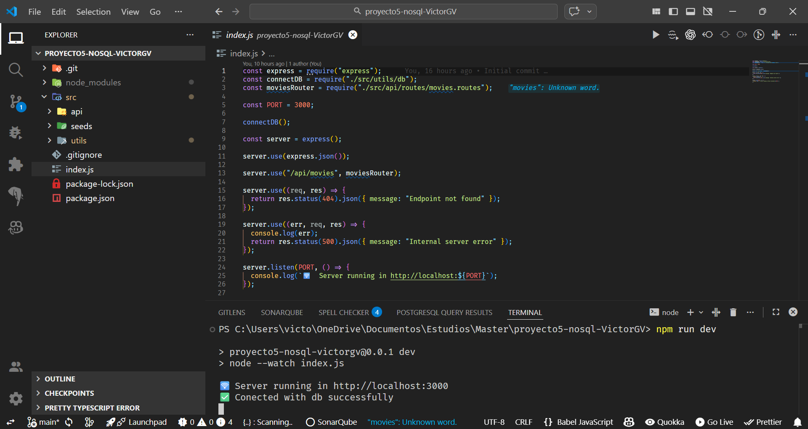

# Proyecto 5 - noSQL (Movies + Actors API)

API REST con Node.js + Express + MongoDB (Mongoose).  
Incluye CRUD completo de **Movies** y un recurso extra **Actors** para practicar endpoints similares.

---

## Stack

- Node.js
- Express
- MongoDB
- Mongoose

---

## Arranque del proyecto

Captura del arranque + conexión a BBDD:

---

## Instalación

1. Instalar dependencias:

   npm install

2. Arrancar el servidor:

   npm run dev

El servidor se levanta en: `http://localhost:3000`

---

## Base de datos (MongoDB local)

La conexión está configurada a MongoDB en local:

- `mongodb://localhost:27017/proyecto-basico-express-movies`

---

## Seed (películas)

Para cargar películas iniciales (seed):

    node src/seeds/movies.seed.js

> Esto borra la colección de `movies` si existe y la vuelve a crear con datos de ejemplo.

---

## Endpoints

### Movies (`/api/movies`)

| Método | Endpoint                   | Descripción                               |
| -----: | -------------------------- | ----------------------------------------- |
|    GET | `/api/movies`              | Listar todas las películas                |
|    GET | `/api/movies/id/:id`       | Obtener película por ID                   |
|    GET | `/api/movies/title/:title` | Buscar por título                         |
|    GET | `/api/movies/year/:year`   | Películas desde el año indicado (>= year) |
|    GET | `/api/movies/genre/:genre` | Buscar por género                         |
|   POST | `/api/movies`              | Crear película                            |
|    PUT | `/api/movies/:id`          | Actualizar película                       |
| DELETE | `/api/movies/:id`          | Eliminar película                         |

Body ejemplo (POST `/api/movies`):

    {
      "title": "The Matrix",
      "director": "Hermanas Wachowski",
      "year": 1999,
      "genre": "Acción"
    }

---

### Actors (`/api/actors`)

| Método | Endpoint             | Descripción              |
| -----: | -------------------- | ------------------------ |
|    GET | `/api/actors`        | Listar todos los actores |
|    GET | `/api/actors/id/:id` | Obtener actor por ID     |
|   POST | `/api/actors`        | Crear actor              |
|    PUT | `/api/actors/:id`    | Actualizar actor         |
| DELETE | `/api/actors/:id`    | Eliminar actor           |

Body ejemplo (POST `/api/actors`):

    {
      "name": "Keanu Reeves",
      "birthYear": 1964,
      "nationality": "Canadian",
      "active": true
    }

---

## Pruebas (Insomnia)

Las capturas de pruebas están en:

- Movies: `docs/movies/`
- Actors: `docs/actors/`

Incluyen llamadas correctas a endpoints + capturas de errores (404/500) y el arranque del proyecto.

---

## 📁 Estructura del proyecto

    src/
      api/
        controllers/
        models/
        routes/
      seeds/
      utils/
    index.js
    docs/
      01-arranque.png
      movies/
      actors/

---

## Autor

Víctor G. V.
